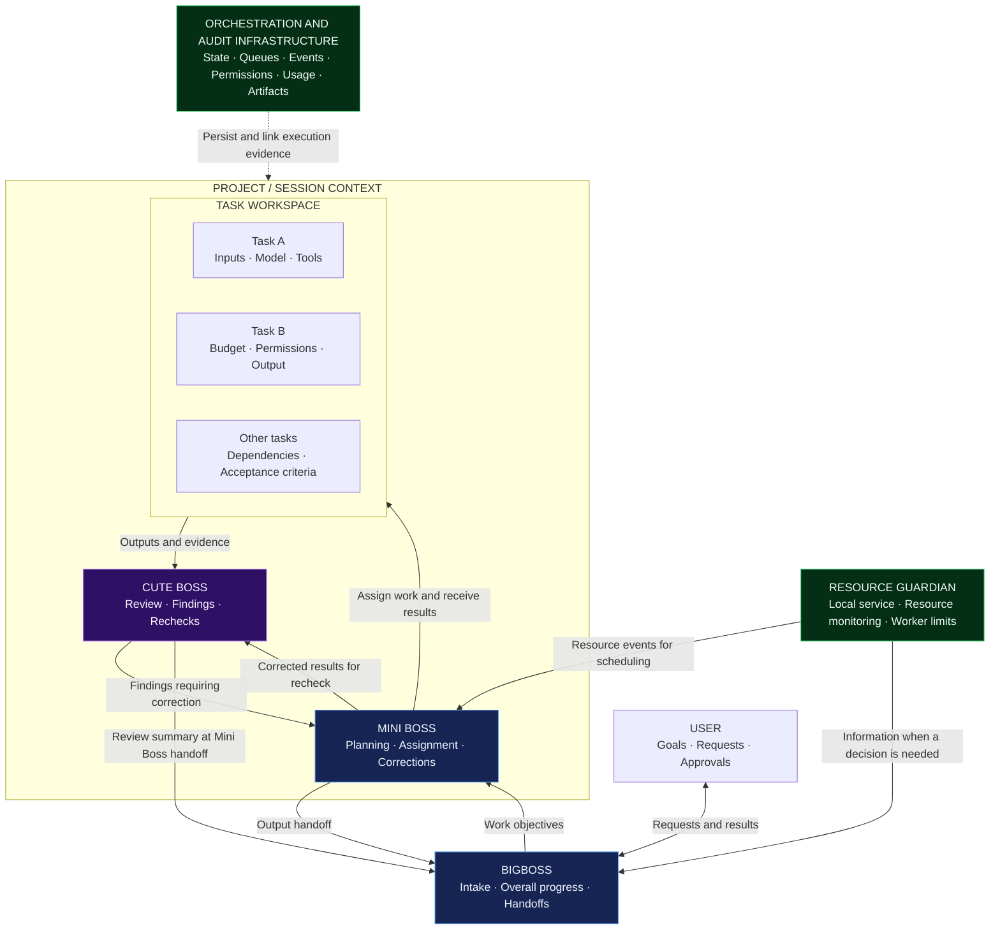
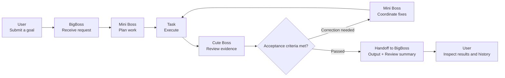
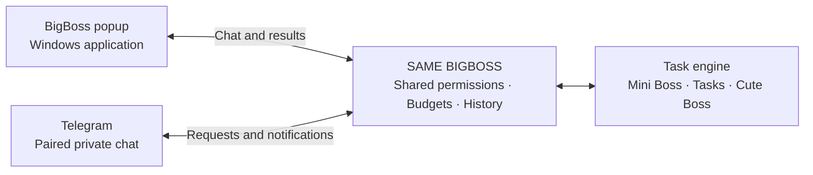

# BIGSPY AI Connect

### One workspace. Coordinated AI. Verifiable progress.

A **local-first Windows workspace** designed to bring task orchestration, independent AI review, and machine resource management into one workflow.

**BigBoss receives · Mini Boss coordinates · Cute Boss reviews**

[Architecture](#coordination-architecture) · [Workspace experience](#workspace-experience) · [Development roadmap](#development-roadmap) · [Download](#download-and-installation)

---

> **Status: desktop preview in development.** The Windows app shell, BigBoss popup, and local workspace metadata tasks are available. AI execution, Cute Boss AI, Telegram, and language switching are not implemented. The diagrams describe the target design. As of October 8, 2026, version 0.1.1 is a draft; check Releases for published builds.

## Download and installation

Visit [GitHub Releases](https://github.com/bentarofficial/bigspy-ai-connect-release/releases) for published builds and version-specific notes. Draft releases are not publicly available.

| Package | Usage |
| :--- | :--- |
| **Setup.exe** | Install the Windows application. Use the installer for in-app updates in versions that support the updater. |
| **Portable** | Run directly for evaluation. Use the installer for the in-app update workflow. |

Version 0.1.1 is being prepared with **Settings → Updates → Check → Download → Install and restart**. Complete or cancel active tasks before installing an update. Version 0.1.0 has no updater and requires a one-time installation of a newer installer.

Application data is stored outside the installation directory at `%APPDATA%/bigspy-ai-connect`. The current distribution design preserves this data and user project folders during upgrades and uninstallation. Preview installers are unsigned; check each release for its exact feature scope.

<strong>Distribution and update metadata</strong>

The application uses this release repository through electron-updater. Each update release requires an NSIS installer, its `.blockmap` file, and `latest.yml` generated from the same build. Publish only when the update artifacts are complete and validated.

---

## From a goal to results with evidence

BIGSPY AI Connect is designed to help users assign goals to AI, track work by project, and receive results with a traceable execution history. Mini Boss breaks work into tasks and coordinates execution. Cute Boss checks outputs and evidence, then sends findings back for correction. BigBoss receives the handoff and provides an overall view of the work.

Each task is intended to carry its goal, inputs, requirement version, permitted models and tools, budget, execution environment, and acceptance criteria. Outputs are linked to artifacts, logs, and review activity so users can verify what happened.

| Design focus | Intended benefit |
| :--- | :--- |
| **Multi-model orchestration** | Select agents, models, and connectors based on capability, permissions, availability, and task budget. |
| **Independent review** | Check outputs against evidence and route findings into a correction and recheck loop. |
| **Project and task context** | Preserve input sources, versions, and handoffs while keeping separate work streams distinct. |
| **Visible progress and usage** | Trace assignments, corrections, outputs, and token usage when provider data is available. |
| **Bounded execution** | Combine tool permissions, approvals, timeouts, retries, budgets, and machine resource limits. |

## Coordination architecture

This diagram describes the intended relationships between roles. The number of Mini Boss and Cute Boss instances per project, and concurrency limits, will be specified in the MVP design.

| Component | Responsibility | Output and collaboration |
| :--- | :--- | :--- |
| **BigBoss** | Receive requests, communicate at the overall level, and track handoffs. | Receive Mini Boss outputs and Cute Boss review summaries. |
| **Mini Boss** | Plan work, assign tasks, collect results, and coordinate corrections. | Hand over results linked to tasks and execution history. |
| **Cute Boss** | Inspect evidence, identify issues, and recheck corrections. | Report findings to Mini Boss; summarize review activity for BigBoss when Mini Boss hands over output. |
| **Task** | Execute scoped work with its own inputs, tools, permissions, and limits. | Produce outputs, artifacts, logs, usage records, and acceptance evidence. |
| **Resource Guardian** | Monitor machine resources, regulate scheduling, and manage Bigspy-owned workers. | Send resource events to Mini Boss and decision-relevant information to BigBoss. |
| **Orchestration and audit infrastructure** | Persist state, events, approvals, results, and usage. | Support traceability, recovery, and evidence links. This is infrastructure rather than another Boss. |

Cute Boss sends its activity summary at the handoff milestone, rather than continuously reporting to BigBoss. That summary is separate from Mini Boss's work output. Resource Guardian follows rules without calling AI for every resource measurement.

## Execution and review loop

Correction loops must stay within agreed token, cost, time, and retry limits. Missing permissions, inputs, connectors, or resources should produce a clear waiting or error state. Work that exceeds limits is escalated according to policy.

## Workspace experience

### Interface language

**Confirmed direction:** English is the default interface language, with an **English / Tiếng Việt** switch in **Settings → Language**. The selected language will be saved and synchronized across the workspace and BigBoss popup. Switching languages will preserve sessions, tasks, and user content.

This is planned under **ST.8** and will be implemented during the corresponding feature stage. It is not available in the current preview.

### Three workspace panels and a desktop BigBoss popup

The main workspace is designed around a sidebar, a Mini Boss panel, and a task panel. BigBoss runs in a separate native desktop popup that can be moved, resized, shown, or hidden while preserving its session.

| Sidebar / menu | Mini Boss panel | Right-hand task panel |
| :--- | :--- | :--- |
| **BigBoss ⋯** — communication channel settings | **Mini Boss tabs** — separate sessions and states | **Task tabs** — tasks belonging to the selected Mini Boss |
| **Show / Hide BigBoss** | Goals, conversation, and plans | Inputs, dependencies, agents, and connectors |
| **New Project** and project list | Coordination, updates, and outputs | Logs, artifacts, review findings, and costs |
| Settings / account | Background tabs retain sessions and run within limits | Approval, cancellation, and reopening controls |

Selecting a Mini Boss restores its own task tabs and most recently selected task. Closing a tab closes its view; cancelling a task is a separate action. Concurrent work remains subject to permissions, budgets, and Resource Guardian limits.

### Desktop and Telegram share the same BigBoss

Telegram is planned as the first communication channel: send text requests, select projects, check progress, and receive results from a phone. Local execution requires the computer to be on, the Bigspy app or service to be running, and an Internet connection. Hiding BigBoss only hides the popup. Images, files, voice, group chats, and a 24/7 relay require separate specifications.

BigBoss requires the installed Windows app and its native bridge. A standalone web or local HTML interface does not provide those capabilities.

### Add requirements while work is running

New input is intended to be persisted and linked to the correct project and task before acknowledgement. Updates to the same work are applied at a safe checkpoint; unrelated work is routed to the appropriate task. Input within a task or dependent work stream follows arrival order, with explicit edits, replacements, and cancellations tracked by requirement version. Independent tasks may run concurrently within permitted limits.

## Permissions, data, and resources

| Control area | Intended design |
| :--- | :--- |
| **Connectors and models** | Publish actual capabilities, authentication methods, read/write permissions, connection health, and limits. Initial providers are still being selected. |
| **External actions** | Check permissions and required approvals at execution time, and record an audit trail. |
| **Secrets and data** | Use a secret store, limit outgoing data, define retention/deletion policies, and treat external content as data. |
| **Budgets** | Limit tokens, cost, time, and correction rounds; distinguish estimates from provider-reported usage. |
| **Local resources** | Monitor RAM, CPU, disk space, and GPU/VRAM when needed; regulate tasks and Bigspy-owned workers. |
| **Task durability** | Support queues, checkpoints, timeouts, bounded retries, duplicate-write prevention, cancellation, and recovery. |

Local-first describes the intended execution and desktop experience. Backend distribution, storage, and the account model still need to be finalized. Data sent to AI providers or connectors is governed by granted permissions and policy.

## Development roadmap

The source repository roadmap is the authoritative progress tracker. The tables below summarize it for users. A completed design decision does not mean the corresponding feature has been built.

| Phase | Focus | Progress gate |
| :--- | :--- | :--- |
| **0 · Specification** | MVP scope, roles, connectors, permissions, data, budgets, and acceptance criteria. | Verifiable decisions; the high-level agent structure is confirmed in **0.2**. |
| **1 · Foundation** | Repository architecture, configuration, schemas, adapters, queues, and storage. | Validate execution, permissions, and recovery foundations. |
| **2 · Orchestration** | BigBoss intake; Mini Boss assignment, feedback handling, and handoffs. | Traceable task flows with explicit states and limits. |
| **3 · Review** | Cute Boss inspection, findings, and handoff summaries. | Evidence-based conclusions, with false positives and missed issues measured. |
| **4 · Interface** | Progress, outputs, reviews, costs, permissions, settings, and language switching. | Users can observe and control their work. |
| **5 · MVP validation** | End-to-end flows, failures, interruptions, and operating documentation. | Pass acceptance gates with at least one real connector. |
| **6 · Self-improvement** | BigBoss prepares changes through branches, commits, and pull requests. | Begin after MVP stability, with quality checks, approval, and rollback. |

The **DT/NP** (Windows, popup, projects), **WS** (workspace), **TK** (tasks), **IN** (ongoing input), **RG** (local resources), **ST** (settings), and **TG** (Telegram text/private chat) work streams feed into the MVP according to the detailed roadmap.

| Priority | Scope |
| :--- | :--- |
| **P0 · MVP** | End-to-end tasks, review and correction, one real connector, Windows desktop, workspace, and permission, cost, resource, and recovery gates. |
| **P1 · After MVP** | A second connector of a different type, advanced monitoring/catalog features, and BigBoss self-improvement. |
| **P2 · Expansion** | Additional connectors based on real demand; consider narrowly scoped auto-merge only after quality thresholds and rollback are established. |

### Three acceptance journeys

1. **Success:** request → BigBoss → Mini Boss → execution → output and Cute Boss report.
2. **Correction:** Cute Boss finding → Mini Boss coordinates a fix → recheck → handoff.
3. **Connection failure:** connector error or revoked permission → clear state → policy-driven handling and validation.

The first MVP release requires logs, artifacts, activity and token reports, permission and cost tests, recovery, and operating documentation. Connector support is measured by connectors that pass contract tests.

## Follow the project

This repository presents the product and distributes Windows installers and update metadata. Source code is maintained in a separate development repository. The MVP AI connector, account model, and some data contracts are still being finalized.

- Review the [development roadmap](#development-roadmap) for planned scope.
- Share suggestions or report problems through [GitHub Issues](https://github.com/bentarofficial/bigspy-ai-connect-release/issues), including the relevant roadmap area and expected outcome.
- Follow [Releases](https://github.com/bentarofficial/bigspy-ai-connect-release/releases) for published, validated builds.

---

**BIGSPY AI Connect**  
From goals to results — with coordination, review, and evidence.

