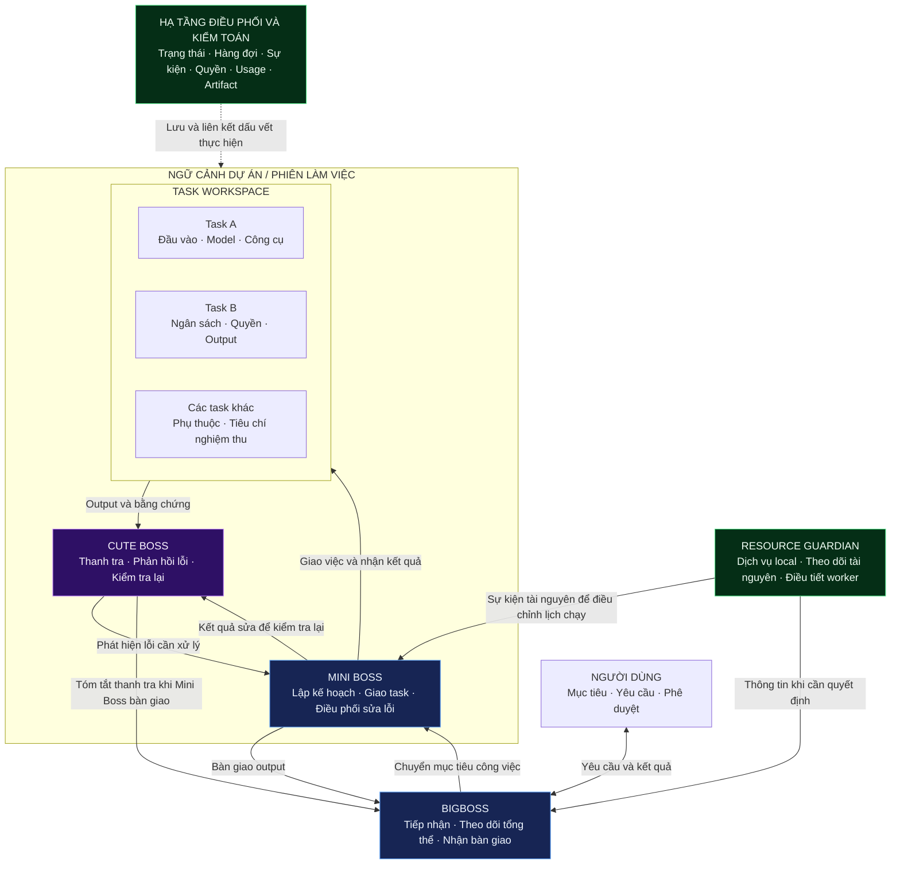
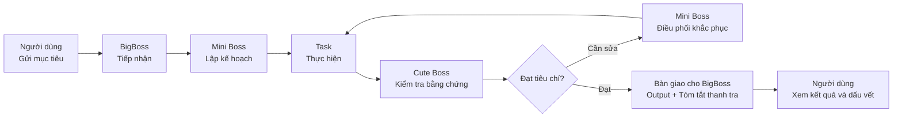
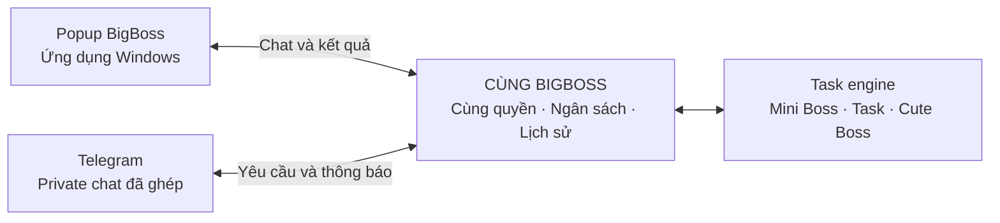

# BIGSPY AI Connect

### Một không gian làm việc. Nhiều AI phối hợp. Tiến độ có thể kiểm chứng.

Ứng dụng Windows theo định hướng **local-first**, kết hợp điều phối công việc, thanh tra độc lập và quản lý tài nguyên máy trong một luồng làm việc thống nhất.

**BigBoss tiếp nhận · Mini Boss điều phối · Cute Boss thanh tra**

[Khám phá kiến trúc](#kiến-trúc-phối-hợp) · [Trải nghiệm dự kiến](#trải-nghiệm-làm-việc) · [Lộ trình phát triển](#lộ-trình-phát-triển) · [Tải và cài đặt](#tải-và-cài-đặt)

---

> **Trạng thái: desktop preview đang phát triển.** Đã có khung ứng dụng Windows, popup BigBoss và task local kiểm tra metadata workspace. AI thực thi, Cute Boss AI, Telegram và chuyển ngôn ngữ chưa triển khai. Các sơ đồ bên dưới mô tả thiết kế mục tiêu. Tại ngày 08/10/2026, bản 0.1.1 đang ở trạng thái draft; hãy xem Releases để biết bản nào đã được công bố.

## Tải và cài đặt

Xem [GitHub Releases](https://github.com/bentarofficial/bigspy-ai-connect-release/releases) để chọn bản đã công bố và đọc ghi chú phiên bản. Release ở trạng thái draft chưa có sẵn cho người dùng công khai.

| Gói | Cách dùng |
| :--- | :--- |
| **Setup.exe** | Cài ứng dụng Windows; dùng installer khi muốn nhận cập nhật trong ứng dụng ở phiên bản có updater. |
| **Portable** | Chạy trực tiếp để thử; dùng installer cho luồng cập nhật trong ứng dụng. |

Bản 0.1.1 đang được chuẩn bị với luồng **Cài đặt → Cập nhật → Kiểm tra → Tải → Cài và khởi động lại**. Cần hoàn tất hoặc hủy task trước khi cài bản mới. Bản 0.1.0 chưa có updater và cần cài installer mới một lần.

Dữ liệu ứng dụng nằm ngoài thư mục cài đặt, tại `%APPDATA%/bigspy-ai-connect`. Theo thiết kế phân phối hiện tại, nâng cấp và gỡ cài đặt giữ dữ liệu này cùng thư mục dự án của người dùng. Preview chưa ký số; phạm vi tính năng cụ thể được ghi trong từng release.

<strong>Thông tin phân phối và dữ liệu cập nhật</strong>

Ứng dụng dùng nguồn release này qua electron-updater. Mỗi bản phát hành phục vụ cập nhật cần installer NSIS, file `.blockmap` và `latest.yml` được tạo cùng build. Chỉ công bố bản khi bộ artifact cập nhật đầy đủ và đã kiểm tra.

---

## Từ yêu cầu đến kết quả có bằng chứng

BIGSPY AI Connect được định hướng giúp người dùng giao mục tiêu cho AI, theo dõi công việc theo dự án và nhận kết quả kèm dấu vết thực hiện. Mini Boss chia và điều phối task; Cute Boss kiểm tra kết quả, phản hồi sai sót để tiếp tục xử lý; BigBoss nhận bàn giao và giúp người dùng theo dõi ở cấp tổng thể.

Mỗi task dự kiến mang theo mục tiêu, đầu vào, phiên bản yêu cầu, model và công cụ được phép, ngân sách, môi trường thực thi cùng tiêu chí nghiệm thu. Kết quả được liên kết với artifact, log và hoạt động thanh tra để người dùng có thể đối chiếu.

| Định hướng | Giá trị hướng tới |
| :--- | :--- |
| **Điều phối nhiều AI** | Chọn agent, model và connector theo năng lực, quyền, mức sẵn sàng và ngân sách của công việc. |
| **Thanh tra độc lập** | Kiểm tra output và bằng chứng; đưa phát hiện lỗi vào luồng sửa và kiểm tra lại. |
| **Ngữ cảnh theo dự án và task** | Giữ nguồn, phiên bản đầu vào và kết quả bàn giao; tránh trộn yêu cầu giữa các công việc. |
| **Minh bạch tiến độ và chi phí** | Truy lại giao việc, xử lý lỗi, output và token theo hoạt động khi nhà cung cấp hỗ trợ số liệu. |
| **Thực thi có giới hạn** | Kết hợp quyền công cụ, phê duyệt, timeout, retry, ngân sách và tài nguyên máy. |

## Kiến trúc phối hợp

Sơ đồ thể hiện quan hệ giữa các vai trò trong thiết kế. Số lượng Mini Boss/Cute Boss trên mỗi dự án và giới hạn đồng thời sẽ được cụ thể hóa trong đặc tả MVP.

| Thành phần | Trách nhiệm | Đầu ra / phối hợp |
| :--- | :--- | :--- |
| **BigBoss** | Tiếp nhận yêu cầu, giao tiếp cấp tổng thể và theo dõi bàn giao. | Nhận output từ Mini Boss và bản tóm tắt thanh tra từ Cute Boss. |
| **Mini Boss** | Chia việc, giao task, nhận kết quả và điều phối xử lý sai sót. | Bàn giao kết quả có liên kết đến task và dấu vết xử lý. |
| **Cute Boss** | Quan sát, kiểm tra bằng chứng, phát hiện lỗi và kiểm tra lại. | Báo lỗi cho Mini Boss; gửi tóm tắt hoạt động cho BigBoss khi Mini Boss xuất output. |
| **Task** | Thực hiện phạm vi công việc với đầu vào, công cụ, quyền và giới hạn riêng. | Output/artifact, log, usage và bằng chứng nghiệm thu. |
| **Resource Guardian** | Theo dõi tài nguyên máy, điều tiết lịch chạy và quản lý worker thuộc Bigspy. | Gửi sự kiện cho Mini Boss; cung cấp thông tin cho BigBoss khi cần quyết định. |
| **Hạ tầng điều phối và kiểm toán** | Lưu trạng thái, sự kiện, phê duyệt, kết quả và mức sử dụng. | Giúp truy lại tiến độ, khôi phục và liên kết bằng chứng; đây là hạ tầng, không phải một Boss. |

Cute Boss không gửi báo cáo liên tục cho BigBoss trong quá trình làm việc. Bản tóm tắt thanh tra được gửi ở mốc bàn giao, phân biệt với kết quả công việc của Mini Boss. Resource Guardian xử lý theo quy tắc và không gọi AI cho từng lần đo tài nguyên.

## Vòng làm việc và kiểm tra

Vòng sửa phải nằm trong giới hạn token, chi phí, thời gian và số lần xử lý đã chốt. Nếu thiếu quyền, đầu vào, connector hoặc tài nguyên, task cần hiển thị trạng thái chờ/lỗi với lý do rõ ràng; những trường hợp vượt giới hạn được chuyển cấp theo chính sách.

## Trải nghiệm làm việc

### Ngôn ngữ giao diện

**Định hướng đã xác nhận:** giao diện mặc định **English**, có nút chuyển **English / Tiếng Việt** trong Cài đặt → Ngôn ngữ. Lựa chọn được ghi nhớ và áp dụng đồng bộ cho workspace cùng popup BigBoss. Chuyển ngôn ngữ giữ nguyên phiên, task và nội dung người dùng. Tính năng này đang được lên kế hoạch ở **ST.8**, chưa có trong preview hiện tại.

### Workspace ba vùng và BigBoss trên desktop

Giao diện chính dự kiến gồm sidebar, bảng Mini Boss và bảng task. BigBoss là popup native riêng trên desktop, có thể kéo, đổi kích thước và ẩn/hiện mà vẫn giữ phiên.

| Sidebar / menu | Bảng Mini Boss | Bảng task bên phải |
| :--- | :--- | :--- |
| **BigBoss ⋯** — thiết lập kênh giao tiếp | **Tab Mini Boss** — phiên và trạng thái riêng | **Tab task** — bộ task của Mini Boss đang chọn |
| **Show / Hide BigBoss** | Mục tiêu, trao đổi và kế hoạch | Đầu vào, phụ thuộc, agent và connector |
| **New Project** và danh sách dự án | Điều phối, cập nhật và output | Log, artifact, phát hiện thanh tra và chi phí |
| Cài đặt / tài khoản | Tab nền giữ phiên và tiếp tục theo giới hạn | Phê duyệt, hủy và mở lại task theo quyền |

Chọn Mini Boss khôi phục đúng bộ tab task và task được xem gần nhất. Đóng tab là đóng vùng hiển thị; hủy task là thao tác riêng. Công việc đồng thời chịu giới hạn quyền, ngân sách và Resource Guardian.

### Desktop và Telegram dùng cùng BigBoss

Telegram được lên kế hoạch là kênh giao tiếp đầu tiên: gửi yêu cầu văn bản, chọn dự án, xem trạng thái và nhận kết quả từ điện thoại. Với thực thi local, máy phải bật, ứng dụng/dịch vụ Bigspy phải chạy và có Internet. Hide BigBoss chỉ ẩn popup. Ảnh, file, voice, group chat và relay 24/7 thuộc phạm vi mở rộng cần đặc tả riêng.

BigBoss cần môi trường ứng dụng Windows đã cài và cầu nối native; giao diện web/local HTML mở riêng không có năng lực này.

### Bổ sung yêu cầu khi task đang chạy

Input mới dự kiến được lưu bền vững và gắn đúng project/task trước khi xác nhận. Bổ sung cho cùng công việc được áp dụng tại điểm an toàn; công việc khác được định tuyến sang task phù hợp. Input cùng task hoặc luồng phụ thuộc xử lý theo thứ tự nhận; yêu cầu sửa, thay thế hoặc hủy rõ ràng được ghi nhận theo phiên bản. Các task độc lập có thể chạy song song trong giới hạn cho phép.

## Quyền, dữ liệu và tài nguyên

| Phạm vi kiểm soát | Thiết kế dự kiến |
| :--- | :--- |
| **Connector và model** | Công bố năng lực thực tế, xác thực, quyền đọc/ghi, tình trạng kết nối và giới hạn. Danh sách nhà cung cấp đầu tiên chưa chốt. |
| **Hành động có tác dụng bên ngoài** | Kiểm tra quyền và phê duyệt tại thời điểm thực hiện; ghi dấu vết để đối chiếu. |
| **Bí mật và dữ liệu** | Quản lý khóa qua kho bí mật, giới hạn dữ liệu gửi ra ngoài, chốt chính sách lưu/xóa và xử lý nội dung bên ngoài như dữ liệu. |
| **Ngân sách** | Giới hạn token, chi phí, thời gian và số vòng sửa; phân biệt số ước tính với số liệu nhà cung cấp. |
| **Tài nguyên local** | Theo dõi RAM, CPU, ổ đĩa và GPU/VRAM khi cần; điều chỉnh số task và worker thuộc Bigspy. |
| **Độ bền tác vụ** | Hàng đợi, checkpoint, timeout, retry có giới hạn, chống ghi trùng, hủy và khôi phục sau gián đoạn. |

Local-first là định hướng thực thi và trải nghiệm trên máy người dùng. Phân bố backend local/remote, lưu trữ và mô hình tài khoản vẫn cần chốt; dữ liệu gửi cho AI/connector phụ thuộc quyền và chính sách đã cấp.

## Lộ trình phát triển

Roadmap trong repo mã nguồn là nguồn theo dõi tiến độ chính thức; bảng dưới đây là bản tóm tắt cho người dùng. Việc hoàn thành một quyết định thiết kế không đồng nghĩa tính năng đã được xây dựng.

| Giai đoạn | Trọng tâm | Điều kiện tiến tới |
| :--- | :--- | :--- |
| **0 · Đặc tả** | Phạm vi MVP, vai trò, connector, quyền, dữ liệu, ngân sách và tiêu chí nghiệm thu. | Các quyết định có thể kiểm chứng; hiện đã xác nhận cấu trúc agent cấp cao ở **0.2**. |
| **1 · Nền tảng** | Kiến trúc repo, cấu hình, schema, adapter, hàng đợi và lưu trữ. | Nền tảng thực thi, quyền và khôi phục được kiểm tra. |
| **2 · Điều phối** | BigBoss tiếp nhận; Mini Boss phân công, xử lý phản hồi và bàn giao. | Luồng task có trạng thái, giới hạn và dấu vết. |
| **3 · Thanh tra** | Cute Boss kiểm tra, phản hồi lỗi và báo cáo ở mốc bàn giao. | Kết luận dựa trên bằng chứng; đo cảnh báo sai và lỗi bỏ sót. |
| **4 · Giao diện** | Tiến độ, output, thanh tra, chi phí, quyền và cài đặt. | Người dùng theo dõi và điều khiển được công việc. |
| **5 · MVP** | Kiểm chứng đầu cuối, lỗi, gián đoạn và tài liệu vận hành. | Các cổng nghiệm thu đạt với ít nhất một connector thật. |
| **6 · Tự cải tiến** | BigBoss chuẩn bị thay đổi qua nhánh/commit/PR. | Triển khai sau MVP ổn định, có kiểm tra chất lượng, phê duyệt và hoàn tác. |

Các luồng **DT/NP** (Windows, popup và dự án), **WS** (workspace), **TK** (task), **IN** (input đang chạy), **RG** (tài nguyên local), **ST** (cài đặt) và **TG** (Telegram văn bản/private chat) được phối hợp vào MVP theo phạm vi chi tiết trong roadmap.

| Ưu tiên | Phạm vi |
| :--- | :--- |
| **P0 · MVP** | Luồng task đầu cuối, thanh tra/sửa lỗi, một connector thật, desktop Windows, workspace và các cổng quyền, chi phí, tài nguyên, khôi phục. |
| **P1 · Sau MVP** | Connector thứ hai khác loại, giám sát/danh mục nâng cao và giai đoạn BigBoss tự cải tiến. |
| **P2 · Mở rộng** | Connector theo nhu cầu thực; chỉ xem xét tự merge phạm vi nhỏ sau khi đạt ngưỡng chất lượng và có rollback. |

### Ba hành trình nghiệm thu bản đầu

1. **Thành công:** yêu cầu → BigBoss → Mini Boss → thực hiện → output và báo cáo Cute Boss.
2. **Phát hiện sai sót:** Cute Boss báo lỗi → Mini Boss điều phối sửa → kiểm tra lại → bàn giao.
3. **Kết nối gặp vấn đề:** connector lỗi hoặc hết quyền → trạng thái rõ ràng → xử lý theo chính sách và kiểm chứng.

Bản phát hành đầu tiên cần có log, artifact, báo cáo hoạt động/token, kiểm thử quyền và chi phí, khả năng phục hồi cùng tài liệu vận hành. Khả năng kết nối được tính bằng connector đã qua kiểm thử hợp đồng.

## Theo dõi dự án

Repo này dùng để giới thiệu sản phẩm, phân phối installer Windows và dữ liệu cập nhật. Mã nguồn được quản lý trong repo phát triển riêng. Connector AI MVP, mô hình người dùng và một số hợp đồng dữ liệu vẫn cần chốt.

- Xem [lộ trình phát triển](#lộ-trình-phát-triển) để hiểu phạm vi dự kiến.
- Gửi đề xuất hoặc báo vấn đề qua [GitHub Issues](https://github.com/bentarofficial/bigspy-ai-connect-release/issues), kèm mục roadmap liên quan và kết quả mong muốn.
- Theo dõi [Releases](https://github.com/bentarofficial/bigspy-ai-connect-release/releases) khi bản đã kiểm chứng được công bố.

---

**BIGSPY AI Connect**  
Từ mục tiêu đến kết quả — có điều phối, có thanh tra, có bằng chứng.

---
